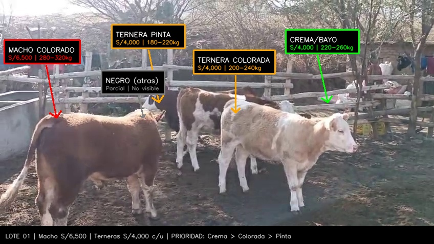

# LOTE 01 — Catálogo Individual (Macho S/ 6,500 | Terneras S/ 4,000 c/u)

---

## Ranking de Prioridad

### ❌ MACHO COLORADO — S/ 6,500 (NO COMPRAR)
- **Raza:** Cruce Simmental × Criollo
- **Color:** Marrón/colorado uniforme, pelo rizado
- **Peso estimado:** 280-320 kg
- **Condición corporal:** 3.0-3.5 (buena)
- **Edad estimada:** 18-24 meses
- **Veredicto:** A S/ 6,500 no hay margen. Mismo precio que vendes el Torito 01.

---

### #1 ⭐⭐⭐⭐ — "CREMA/BAYO" (La Mejor Ternera)
- **Raza:** Cruce Simmental × Brown Swiss
- **Color:** Crema/bayo claro, cara blanca
- **Peso estimado:** 220-260 kg
- **Condición corporal:** 2.5-3.0
- **Edad estimada:** 14-18 meses
- **Precio pedido:** S/ 4,000
- **Precio objetivo negociado:** S/ 3,000 - 3,500
- **Venta mejorada (30d):** S/ 5,000 - 5,500
- **Por qué #1:** Buen tamaño, color atractivo, doble propósito (carne o recría). Mayor margen.

---

### #2 ⭐⭐⭐ — "TERNERA COLORADA"
- **Raza:** Cruce Simmental × Holstein
- **Color:** Marrón con manchas blancas
- **Peso estimado:** 200-240 kg
- **Condición corporal:** 2.5
- **Edad estimada:** 12-16 meses
- **Precio pedido:** S/ 4,000
- **Precio objetivo negociado:** S/ 3,000 - 3,500
- **Venta mejorada (30d):** S/ 4,500 - 5,000

---

### #3 ⭐⭐⭐ — "TERNERA PINTA"
- **Raza:** Holstein Rojo
- **Color:** Marrón rojizo con manchas blancas grandes
- **Peso estimado:** 180-220 kg
- **Condición corporal:** 2.0-2.5 (la más flaca)
- **Edad estimada:** 10-14 meses
- **Precio pedido:** S/ 4,000
- **Precio objetivo negociado:** S/ 3,000 - 3,500
- **Venta mejorada (30d):** S/ 4,000 - 4,500
- **Nota:** Es la más flaca = más margen de mejora pero más tiempo de engorde.

---

## Veredicto Lote 01

> El macho a S/ 6,500 está **descartado**. Las terneras a S/ 4,000 solo valen la pena si negocias a **S/ 3,000 - 3,500 c/u**.
>
> **Frase de negociación:** *"Las terneras a 4,000 no me dan. A 3,000 cada una me llevo las 3 hoy — son S/ 9,000 cash. Si no, paso."*
