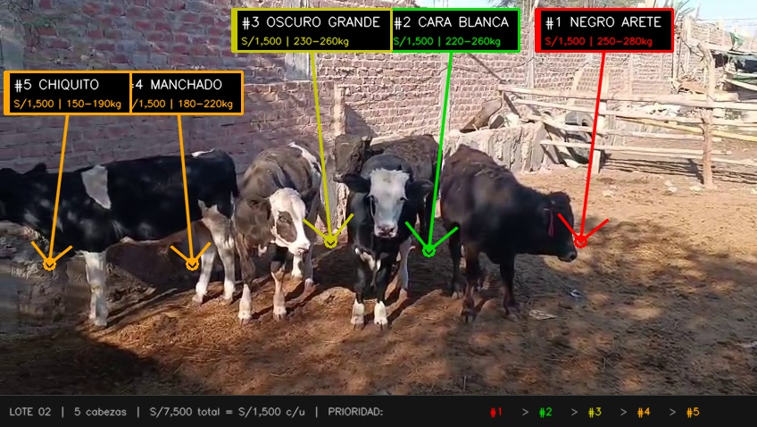

# LOTE 02 — Catálogo Individual (5 cabezas × S/ 7,500 = S/ 1,500 c/u)

---

## Ranking de Prioridad de Compra

### #1 ⭐⭐⭐⭐⭐ — "NEGRO ARETE" (El Líder)
- **Raza:** Cruce Angus × Criollo
- **Color:** Negro completo, pelo denso
- **Identificación:** Arete rojo en oreja derecha
- **Peso estimado:** 250-280 kg
- **Condición corporal:** 3.0-3.5 (el mejor del lote)
- **Edad estimada:** 18-22 meses
- **Precio individual:** S/ 1,500
- **Precio venta mejorado (30 días):** S/ 4,000 - 5,000
- **Ganancia estimada:** S/ 1,875 - 2,875
- **Por qué #1:** Es el más grande, más robusto, mejor presentación. El negro con pelo brillante se vende más fácil. Ya tiene buena condición, con 30 días de dieta queda espectacular.

---

### #2 ⭐⭐⭐⭐ — "CARA BLANCA" (El Segundo)
- **Raza:** Holstein Negro clásico
- **Color:** Negro con cara y patas blancas
- **Identificación:** Cara completamente blanca, cuerpo negro
- **Peso estimado:** 220-260 kg
- **Condición corporal:** 2.5-3.0
- **Edad estimada:** 14-18 meses
- **Precio individual:** S/ 1,500
- **Precio venta mejorado (30 días):** S/ 3,500 - 4,500
- **Ganancia estimada:** S/ 1,375 - 2,375
- **Por qué #2:** Buen tamaño, raza reconocible. Tiene más margen de mejora visual que el Negro Arete. La cara blanca lo hace fácil de identificar y vender.

---

### #3 ⭐⭐⭐⭐ — "OSCURO GRANDE" (El Potencial)
- **Raza:** Cruce Holstein × Brown Swiss
- **Color:** Marrón oscuro/negro, cara oscura con frente blanca
- **Identificación:** Sin arete, pelo marrón oscuro casi negro
- **Peso estimado:** 230-260 kg
- **Condición corporal:** 2.5
- **Edad estimada:** 14-18 meses
- **Precio individual:** S/ 1,500
- **Precio venta mejorado (30 días):** S/ 3,500 - 4,500
- **Ganancia estimada:** S/ 1,375 - 2,375
- **Por qué #3:** Estructura ósea grande = va a ganar peso rápido. Está más flaco que los 2 anteriores, lo que significa MÁS margen de mejora visual.

---

### #4 ⭐⭐⭐ — "MANCHADO" (El Joven)
- **Raza:** Holstein Negro
- **Color:** Negro con manchas blancas grandes en lomo y costado
- **Identificación:** Manchas blancas irregulares en el cuerpo
- **Peso estimado:** 180-220 kg
- **Condición corporal:** 2.0-2.5 (el más flaco)
- **Edad estimada:** 10-14 meses
- **Precio individual:** S/ 1,500
- **Precio venta mejorado (30 días):** S/ 3,000 - 3,500
- **Ganancia estimada:** S/ 875 - 1,375
- **Por qué #4:** Es el más joven y flaco. Necesita más tiempo para verse bien. Pero a S/ 1,500 sigue siendo rentable.

---

### #5 ⭐⭐⭐ — "CHIQUITO" (El Pequeño)
- **Raza:** Holstein Negro × Criollo
- **Color:** Negro y blanco, patrón típico Holstein
- **Identificación:** El más pequeño del lote, patas blancas
- **Peso estimado:** 150-190 kg
- **Condición corporal:** 2.0-2.5
- **Edad estimada:** 8-12 meses
- **Precio individual:** S/ 1,500
- **Precio venta mejorado (30 días):** S/ 2,500 - 3,000
- **Ganancia estimada:** S/ 375 - 875
- **Por qué #5:** Es el más pequeño. A S/ 1,500 el margen es menor. Pero sirve como "bonus" si compras el lote completo.

---

## Resumen: Si solo puedes comprar 2 o 3

### Opción A: Comprar 3 mejores (pedir descuento)

| Animal | Precio | Venta estimada | Ganancia |
|---|---|---|---|
| #1 Negro Arete | S/ 1,500 | S/ 4,500 | S/ 2,375 |
| #2 Cara Blanca | S/ 1,500 | S/ 4,000 | S/ 1,875 |
| #3 Oscuro Grande | S/ 1,500 | S/ 4,000 | S/ 1,875 |
| **TOTAL** | **S/ 4,500** | **S/ 12,500** | |
| Flete | S/ 150 | | |
| Alimentación 30d (x3) | S/ 1,575 | | |
| **INVERSIÓN TOTAL** | **S/ 6,225** | | |
| **GANANCIA NETA** | | | **S/ 6,275** |
| **ROI** | | | **101%** |

> **Negociación:** *"Me llevo 3 a S/ 4,000 los tres. Te estoy quitando 3 bocas de encima hoy."*

### Opción B: Comprar 2 mejores

| Animal | Precio | Venta estimada | Ganancia |
|---|---|---|---|
| #1 Negro Arete | S/ 1,500 | S/ 4,500 | S/ 2,375 |
| #2 Cara Blanca | S/ 1,500 | S/ 4,000 | S/ 1,875 |
| **TOTAL** | **S/ 3,000** | **S/ 8,500** | |
| Flete | S/ 100 | | |
| Alimentación 30d (x2) | S/ 1,050 | | |
| **INVERSIÓN TOTAL** | **S/ 4,150** | | |
| **GANANCIA NETA** | | | **S/ 4,350** |
| **ROI** | | | **105%** |

> **Negociación:** *"Me llevo los 2 mejores a S/ 2,500 los dos. Cash hoy."*

---

## Comparativa Final

| Opción | Inversión | Ganancia | ROI |
|---|---|---|---|
| Lote completo (5) | S/ 10,525 | S/ 6,975 | 66% |
| **Top 3** | **S/ 6,225** | **S/ 6,275** | **101%** |
| Top 2 | S/ 4,150 | S/ 4,350 | 105% |

> **Mejor ROI:** Comprar 2 (105%). **Mejor ganancia total:** Comprar 3 (S/ 6,275).
